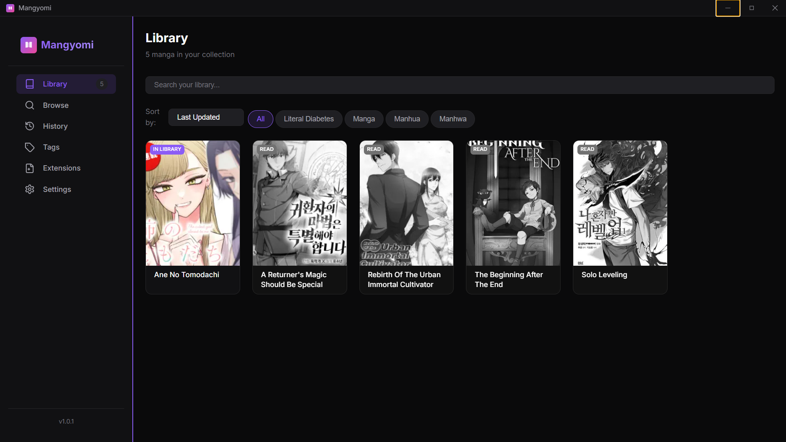
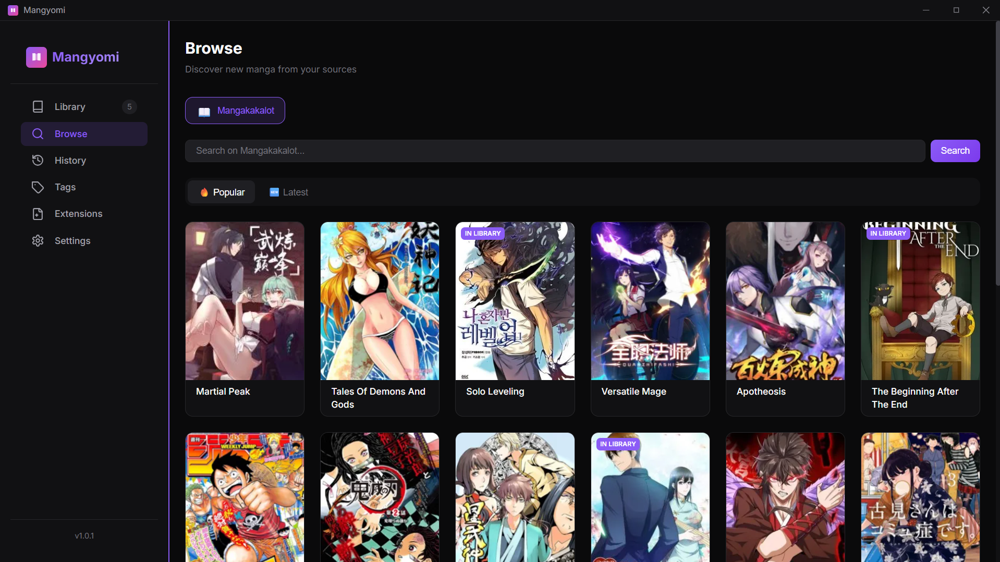
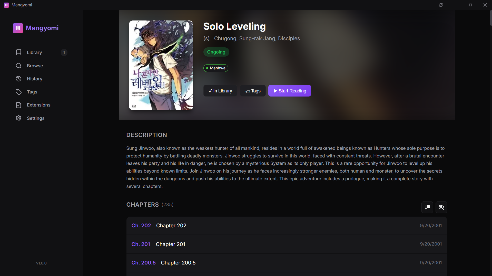
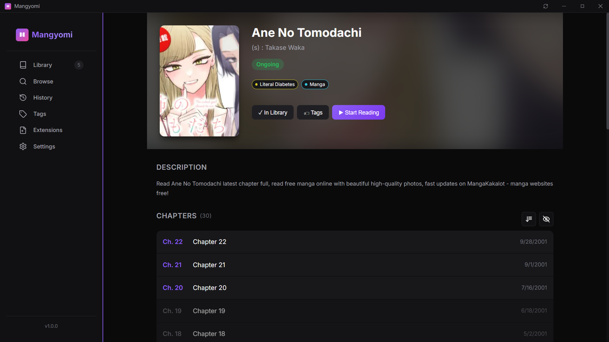
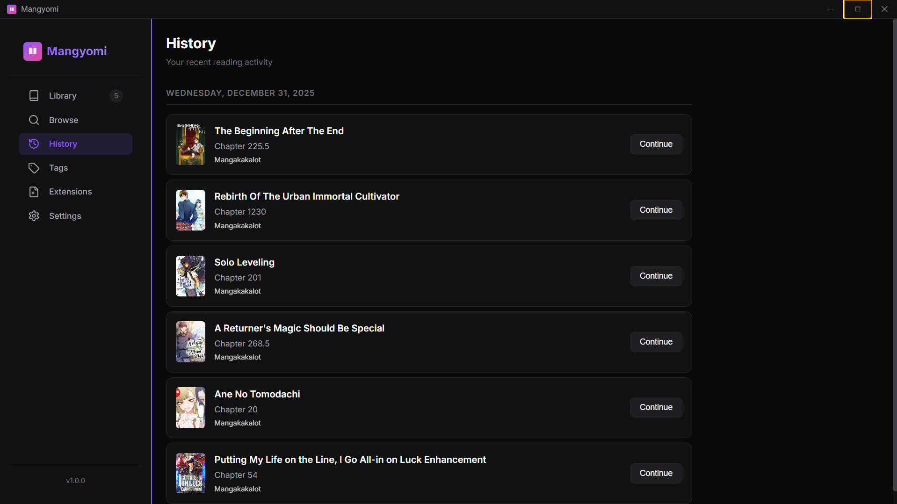
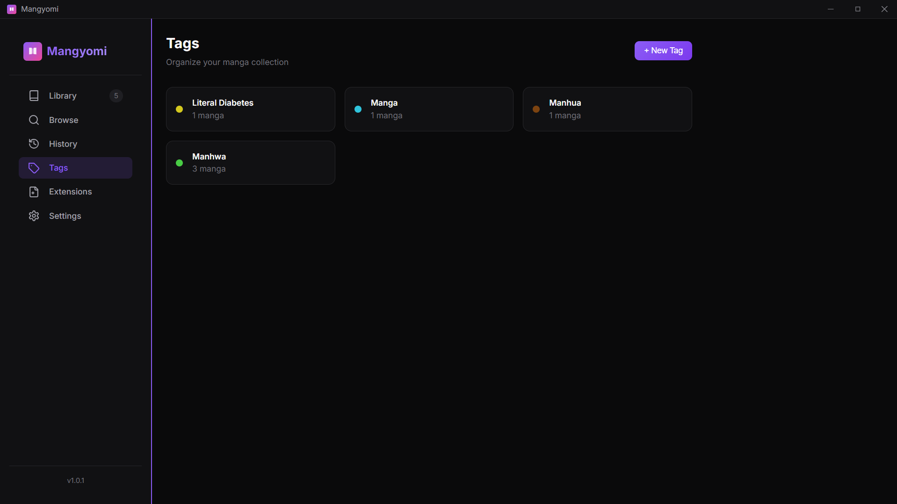
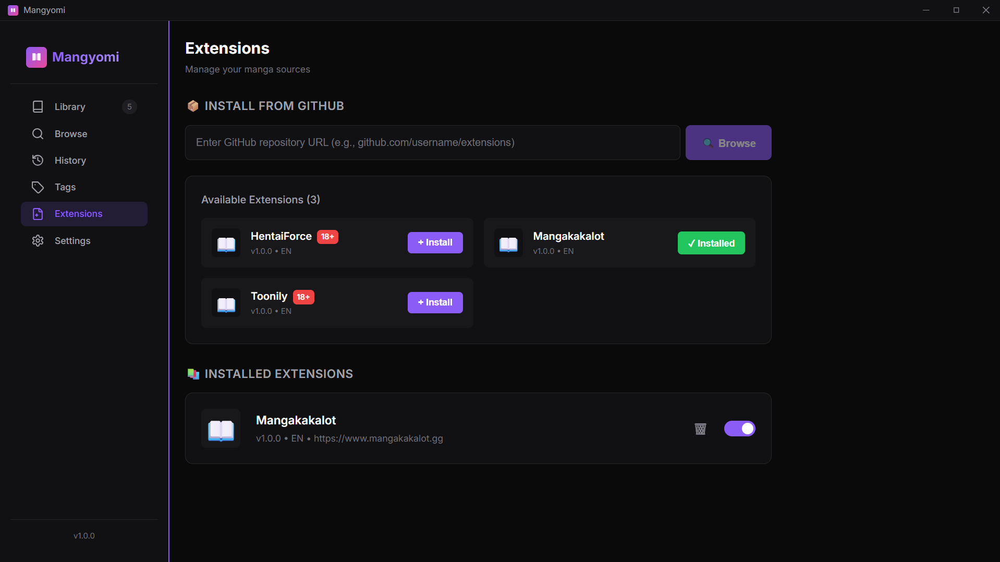

# Mangyomi Showcase 📸

A visual tour of Mangyomi's features and interface.

## Library
Organize your manga collection with custom tags and categories.

## Browse Sources
Discover and search manga from multiple sources via extensions.

## Manga Details
View detailed information about manga including cover, description, and chapters.

## Reading History
Track your reading progress across all manga.

## Tags
Organize manga with custom colored tags for easy categorization.

## Extensions
Install and manage extensions directly from GitHub repositories.

## Settings
Customize theme, reader mode, prefetch behavior, and debug options.

| General | Library |
| :---: | :---: |
|  |  |
| **Reader** | **Storage** |
|  |  |
| **Discord** | **Advanced** |
|  |  |
